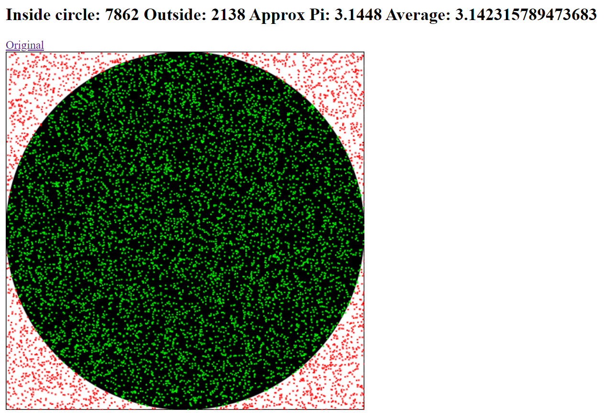

# Monte Carlo Pi Calculation

## What is it?
The Monte Carlo method for calculating pi is quite an interesting thing. I do not understand why it provides an approximation of pi, but I know how to calculate it. 

You start with a square of `n` width and a circle inside that square of `n` diameter. You then place many random points inside that square. Let `i` be the amount of points inside the circle, and `t` be the total amount of points.

To calculate an approximation of pi, this is the formula: `4(i/t)`

## Here's an example
